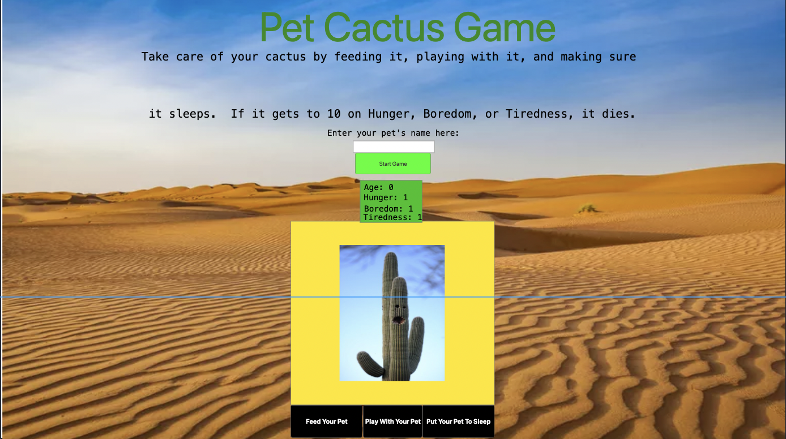

Explanation of the Project:

In this project, I was asked to create a Tamagotchi game with any pet of my choosing.  I had to make it so you could feed, play with, and put your pet to sleep, and if it got too hungry, bored, or tired, it would die.  I chose to make my game with a pet cactus.

User Stories:

When the user enters their cactus's name into the input and pushes the "Start Game" button, the game begins.  The cactus's age starts at 0, and its hunger level, boredom level, and tiredness level start at 1.  The cactus's age increases by 1 every second.  When the user clicks the "Feed Your Cactus" button, the cactus's hunger level decreases by 1.  When the user clicks the "Play With Your Cactus" button, the cactus's boredom level decreases by 1.  When the user clicks the "Put Your Cactus To Sleep" button, the cactus's tiredness level decreases by 1.  The hunger level, boredom level, and tiredness level increase by 1 every 1 second.  If the cactus's hunger level, boredom level, or tiredness level reaches 10, the cactus dies and the game is over.  The game is reset and the user can start over with a new cactus.

Technologies Used: 

HTML, CSS and JavaScript

Appoach Taken:  

First, I set up the basic layout with HTML.  I created an h1 for the title, an h2 for the subtitle, and an h3 for the directions for the input.  Next, I made a div with an input for the pet's name inside.  Then, I made a div with the start button inside and a div with the age, hunger level, boredom level, and tiredness level inside.  Finally, I created a div for the game screen and a div with the feed, play, and sleep buttons.  Next, I styled everything with CSS, including adding a bakground image and image of the cactus.  In JavaScript, I declared some variables at the beginning, then created a function called addLevels that added a level to hunger, boredom, and tiredness and reset the game if any of those levels was at 10.  Then I made a function called agePet that increased age by 1.  Then I created a class called Cactus and set the instance of that class to null.  I made a nameInput function that saved the user's name input as a variable and started the game.  I made a startGame function that created a new Cactus and created 2 intervals, one for age and one for hunger, tiredness and boredom.  Finally, I added a feedPet function that decreased hunger by 1, a playWithPet function that decreased boredom by 1, a putPetToSleep function that decreased tiredness by 1, and 4 event listeners for the start, feed, play, and sleep buttons.

Installation Instructions: 

Clone down this deployed Github repo and open the index.html file in the browser: https://marshallwatrous.github.io/tamagotchi-project/

Unsolved Problems: 

I wanted to do some extras like making the cactus's image change when it reaches certain ages or add images of it eating, playing, and sleeping when the user feeds it, plays with it, and puts it to sleep.  Unfortunately, I did not have time to do these.

Other Components Previously Indicated:

Go to this Github pages link: https://marshallwatrous.github.io/tamagotchi-project/ 

Wireframe:

